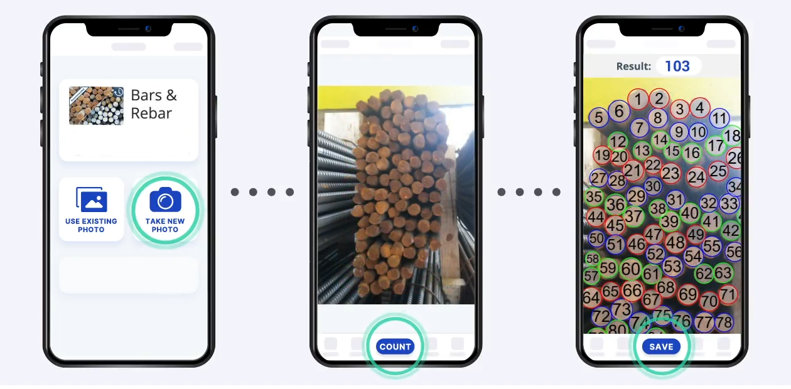

# Rebar Counter Project

## Introduction
In this project, we developed a Rebar Counter model to accurately count rebars (reinforcement bars) in images using machine learning and integrated it into a mobile application. The project employed TensorFlow Lite (TFLite) Model Maker for model training and utilized a Flutter-based mobile application for deployment. Firebase was used for database management, while the TFLite library facilitated model integration.

## Project Overview

### Objective
The primary objective of this project was to create an efficient and accurate model for counting rebars in construction images. This model is intended to streamline construction monitoring and inventory management processes by providing automated rebar counting capabilities.

### Tech Stack
- **Model Training**: TensorFlow Lite Model Maker
- **Mobile Application**: Flutter
- **Database Management**: Firebase
- **Model Integration**: TFLite Library

## Steps and Methodology

### 1. Data Collection
- **Objective**: Gather a diverse dataset of images containing rebars to ensure the model generalizes well across various scenarios.
- **Data Sources**: Construction sites, engineering databases, and industry partners.
- **Image Specifications**: Images were collected in various lighting conditions, angles, and rebar arrangements to enhance the model's robustness.

### 2. Data Preprocessing
- **Objective**: Prepare the collected data for model training by cleaning and structuring it effectively.
- **Resizing**: Images were resized to a uniform dimension compatible with the model requirements.
- **Normalization**: Pixel values were normalized to standardize the input data.
- **Augmentation**: Techniques such as rotation, flipping, and brightness adjustments were applied to increase dataset diversity and improve model performance.

### 3. Data Annotation
- **Objective**: Annotate images to provide the necessary labels for supervised learning.
- **Annotation Tool**: Roboflow was used for drawing bounding boxes around rebars.
- **Labeling**: Each image was labeled with the number of rebars and their positions to train the model in counting and localization.

### 4. Model Training
- **Objective**: Develop and train a model to accurately detect and count rebars.
- **Model Selection**: TFLite Model Maker was used for its simplicity and efficiency in adapting pre-trained models to specific tasks.
- **Training Process**: The annotated dataset was used to fine-tune a pre-trained object detection model, optimizing it for rebar detection and counting.
- **Evaluation**: The model’s performance was assessed using metrics such as precision, recall, and F1 score, with adjustments made based on validation results.

## Mobile Application Integration

### Application Development
- **Objective**: Create a user-friendly mobile application to leverage the trained model for rebar counting.
- **UI Framework**: Flutter was chosen for its capability to build natively compiled applications for mobile from a single codebase.
- **Features**:
  - **Image Capture**: Users can capture images directly through the app.
  - **Rebar Detection**: The app uses the TFLite model to detect and count rebars in real-time.
  - **Results Display**: Detected counts and bounding boxes are displayed on the image for user verification.
